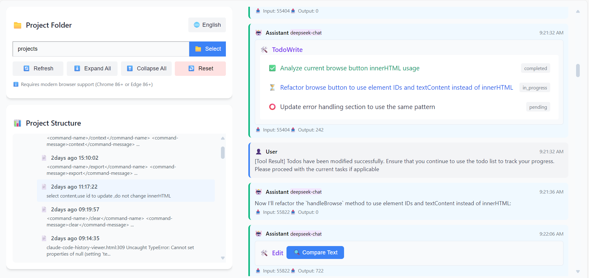

# Claude JSONL History Viewer

**A single-file web application for browsing and analyzing Claude Code conversation histories.**

This application provides a beautiful visual interface for exploring Claude AI conversations, including user messages, assistant responses, tool calls, and metadata. Think of it as a developer-friendly IDE for your AI conversations!

> [中文文档](README_CN.md) | English Documentation

## 🚀 Quick Start

### Usage
1. **Download**: Get the single HTML file
2. **Open**: Open `claude-code-history-viewer.html` in Chrome/Edge
3. **Select**: Click "Select" button to choose project folder with JSONL files
4. **Browse**: Click JSONL files in left file tree to view conversation details

### Browser Requirements
- **Chrome 86+** or **Edge 86+** (recommended)
- Requires File System Access API support
- Not supported: Safari and Firefox (limited API support)

## ✨ Features

### 🎯 Core Features
- **Single-file application**: No build process, no external dependencies - just one HTML file!
- **File system access**: Uses modern browser File System Access API to read local directories and JSONL files
- **Multi-language support**: Complete Chinese/English interface switching
- **Advanced search**: Full-text search across all conversations with powerful filtering options

### 📊 Smart Data Visualization
- **JSONL format support**: Parses standard Claude conversation JSONL format
- **Session grouping**: Automatically groups conversation sessions by sessionId
- **Message type recognition**: Supports user, assistant, system, summary, and other message types
- **Tool call visualization**: Special handling for common tools (TodoWrite, Edit, MultiEdit, etc.)

### 🎨 Developer Experience
- **File tree navigation**: Collapsible project structure browsing with real-time previews
- **Message color coding**: Different colors for different message types
- **Syntax highlighting**: Beautiful JSON data syntax highlighting
- **Text comparison**: Built-in diff viewer for Edit/MultiEdit tools
- **Todo rendering**: Visual display for TodoWrite tool with status tracking

### 🔍 Advanced Search Functionality
- **Full-text search**: Search across all conversations and message content
- **Scope selection**: Search in current file or across all project files
- **Flexible options**: Case-sensitive search, regular expression support, filename search
- **Rich results display**: Shows file information, modification dates, and project folders
- **Smart navigation**: One-click navigation to search results with file tree expansion
- **Interactive interface**: Left-right split layout with search controls and results
- **Real-time highlighting**: Visual feedback for matched content and selected files

## 🏗️ Architecture Design

### Component Architecture
- **ClaudeCodeHistoryApp**: Main application container managing layout and state
- **DataManager**: Central data management with IndexedDB persistence and search capabilities
- **StyleManager**: Centralized style management with embedded Tailwind CSS
- **FileBrowser**: File tree navigation component with smart file discovery
- **MessageViewer**: Conversation display component with message highlighting
- **SearchManager**: Advanced search functionality with cross-file support
- **SearchResultsViewer**: Interactive search results display with navigation
- **LanguageManager**: Multi-language management component

### Core Functionality
- **Directory traversal**: Recursively scans project directory structure
- **JSONL parsing**: Session grouping and message extraction with error tolerance
- **Content extraction**: Type-specific content processing and indexing
- **Tool rendering**: Special tool visualization with syntax highlighting
- **Data persistence**: Uses IndexedDB to save directory handles
- **Full-text search**: Cross-conversation search with advanced filtering
- **Smart navigation**: File tree expansion and message highlighting
- **Internationalization**: Complete multilingual interface support

## 🛠️ Technical Features

### 🌐 Internationalization Support
- Chinese/English translations
- Automatic browser language detection
- Dynamic language switching

### ⚡ Performance Optimizations
- Asynchronous file preview loading
- Incremental JSONL parsing
- Non-blocking IndexedDB operations
- Embedded CSS avoids external dependencies

### 🔒 Security Considerations
- HTML content escaping to prevent XSS attacks
- File access permission management
- Data stored locally, no server upload

## 💡 Use Cases

- **Code review**: See how Claude approached complex problems
- **Learning**: Study effective prompting techniques
- **Debugging**: Understand tool usage patterns
- **Documentation**: Extract insights from past conversations
- **Team collaboration**: Share conversation snippets with team members
- **Knowledge retrieval**: Quick search across all project conversations
- **Pattern analysis**: Find similar solutions or approaches across conversations
- **Reference lookup**: Locate specific information from past interactions

## 🔧 Development Guide

### Custom Development
To extend functionality, focus on these components:
- **DataManager**: Add new data parsing logic
- **MessageViewer**: Add new rendering components
- **LanguageManager**: Add new translation texts
- **StyleManager**: Add new style definitions

### Testing Methods
- Open HTML file directly in browser for testing
- Use real Claude JSONL files for validation
- Check browser console for error messages

## 📄 License

This project is for learning and research purposes only.

## 🤝 Contributing

Welcome to submit issues and improvement suggestions! I'm particularly interested in:
- Additional tool visualizations
- Performance optimizations
- Browser compatibility improvements

## 🔮 Future Plans

- Export conversations to markdown and PDF formats
- Advanced statistics and analytics dashboard
- Plugin system for custom tool rendering
- Conversation tagging and categorization
- Bookmarking and annotation features
- Integration with external documentation tools

---

**Note**: This project requires modern browser support. Please ensure using Chrome 86+ or Edge 86+ versions for the best experience.

*All data stays on your machine - no server uploads, complete privacy.*